# Mermaid Chart Editor

A modern, feature-rich editor for creating and previewing Mermaid diagrams with real-time rendering, syntax highlighting, and AWS icons support.

## Features

- 🎨 Real-time Mermaid diagram preview
- 🌈 Monokai-inspired syntax highlighting
- 🔍 Smart code formatting with proper indentation
- 📦 AWS icons support via `@valravnx/aws-icons`
- 🛠️ Context menu with formatting options
- 💡 CodeMirror editor with advanced features:
  - Line numbers
  - Active line highlighting
  - Code folding
  - Bracket matching
  - Multiple selections
  - Search functionality

## Getting Started

### Prerequisites

- Node.js (v14 or higher)
- npm (v6 or higher)

### Installation

```bash
# Clone the repository
git clone [your-repo-url]

# Navigate to the project directory
cd mermaid-chart

# Install dependencies
npm install

# Start the development server
npm start
```

### Usage

1. Enter your Mermaid diagram code in the left panel
2. See the rendered diagram in real-time on the right panel
3. Right-click in the editor to access the context menu with formatting options
4. Use AWS icons in your diagrams with the `aws` prefix

### Example Diagram

```mermaid
architecture-beta
  group api(aws:ecs)[Angular App]
    service db(aws:elb)[Database] in api
    service disk1(disk)[Storage] in api
    service disk2(disk)[Storage] in api
    service server(server)[Server] in api
```



## Technologies Used

- React
- Mermaid.js
- CodeMirror
- AWS Icons
- Iconify

## Resources

- [Mermaid.js Documentation](https://mermaid.js.org/)
- [Mermaid Icons Configuration](https://mermaid.js.org/config/icons.html)
- [AWS Architecture Icons](https://aws.amazon.com/architecture/icons/)

## Contributing

Contributions are welcome! Please feel free to submit a Pull Request.

## License

This project is licensed under the MIT License - see the LICENSE file for details.
https://icones.js.org/collection/all?s=aws